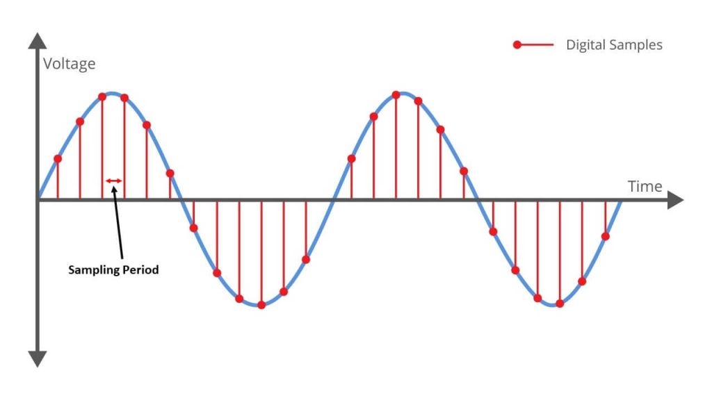

Before we can calculate a target’s **Distance ($R$)**, **Velocity ($v$)**, or **Angle ($\theta$)**, our software pipeline needs one core input: **The Beat Frequency ($f_b$)**.

To understand how we get this value into our software matrix, we have to trace the signal's journey from the moment the radar antenna senses a physical wave to the moment it becomes a digital voltage array in memory.

## 1. The Physical Sensing Problem

When the radar antenna receives a reflected signal from an object in space, that wave is an analog electromagnetic signal oscillating at a multi-gigahertz carrier frequency (typically around **$77\text{ GHz}$**—or 77 billion cycles per second).

To process this wave in software, a computer needs digital numbers (integers or floats). The component responsible for converting continuous analog voltages into digital points is the **Analog-to-Digital Converter (ADC)**.

### Why Direct Sampling Fails

An ADC operates at a fixed **Sampling Rate ($F_s$)**, taking snapshot measurements at precise microsecond intervals. A typical low-cost radar ADC samples around **$1\text{ to }10\text{ million samples per second}$** ($1\text{--}10\text{ MS/s}$).

This creates a massive physical bottleneck:

- The incoming wave oscillates at **$77\text{ GHz}$** ($77,000\text{ MHz}$).
    
- According to the **Nyquist-Shannon Sampling Theorem**, to digitize a wave without losing its shape, the ADC must sample at **at least double** the wave's frequency ($F_s \ge 2 \cdot f$).
    
- Trying to sample a $77\text{ GHz}$ signal directly would require an ADC running at over **$154\text{ GHz}$** ($154\text{ billion samples per second}$).
    

If we attempt to feed a $77\text{ GHz}$ wave directly into a $1\text{ MS/s}$ ADC, the converter takes snapshots so far apart that it misses billions of wave cycles between every single point. This causes severe **aliasing**—completely ruining the signal and turning your data into useless noise.

Building an ADC fast enough to sample $77\text{ GHz}$ directly would either be impossible or far too expensive and power-hungry for practical engineering. We need another approach.

## 2. The Analog Mixer Solution (Down-Conversion)

Instead of forcing the ADC to handle impossibly high frequencies, we place an analog component called a **Mixer** in the circuit _before_ the ADC.

### How the Mixer Works

The Mixer takes the incoming radio frequency signal (the received echo $f_{rx}$) and multiplies it with a Local Oscillator signal (the currently transmitted chirp $f_{tx}$).

By multiplying two analog sine waves together, trigonometric product-to-sum rules naturally split the combined signal into two distinct frequency outputs:

1. **Up-Converted Signal (Sum Frequency):** $f_{tx} + f_{rx} \approx 154\text{ GHz}$
    
2. **Down-Converted Signal (Difference Frequency):** $\vert{}f_{tx} - f_{rx}\vert{} = f_b \approx 1\text{ to }10\text{ MHz}$
    

The down-converted difference frequency is **our exact Beat Frequency ($f_b$)**!

for deeper understanding of the mixer u can visit this link [click](https://en.wikipedia.org/wiki/Frequency_mixer)

## 3. Filtering & ADC Output

Now that the mixer has generated the difference frequency, we pass the combined analog output through a **Low-Pass Filter**:

- The filter completely blocks and discards the high-frequency $154\text{ GHz}$ up-shifted signal.
    
- The low-frequency **Beat Signal ($1\text{--}10\text{ MHz}$)** passes through unaffected.
    

![[ChatGPT Image Aug 11, 2026, 02_12_09 AM.png]]

### The Final ADC Output

Because the signal frequency is now dropped from $77\text{ GHz}$ down to a few megahertz, our standard $10\text{ MS/s}$ ADC can easily capture it without violating the Nyquist limit.

During each chirp duration ($T_c$), the ADC takes multiple snapshot voltage readings, creating a digital time-series vector:

- **X-Axis:** Sample Time / Index (Fast-Time Axis)
    
- **Y-Axis:** Measured Instantaneous Voltage (mV)
    

When these sampled points are connected sequentially in memory, **they form the smooth, digital time-domain sine wave of our beat signal.**

**have a look at this graph..** 

This clean digital array is what gets loaded into our 3D NumPy matrix `(K Antennas, M Chirps, N Samples)` for the software DSP pipeline to perform Range, Velocity, and Angle calculations!