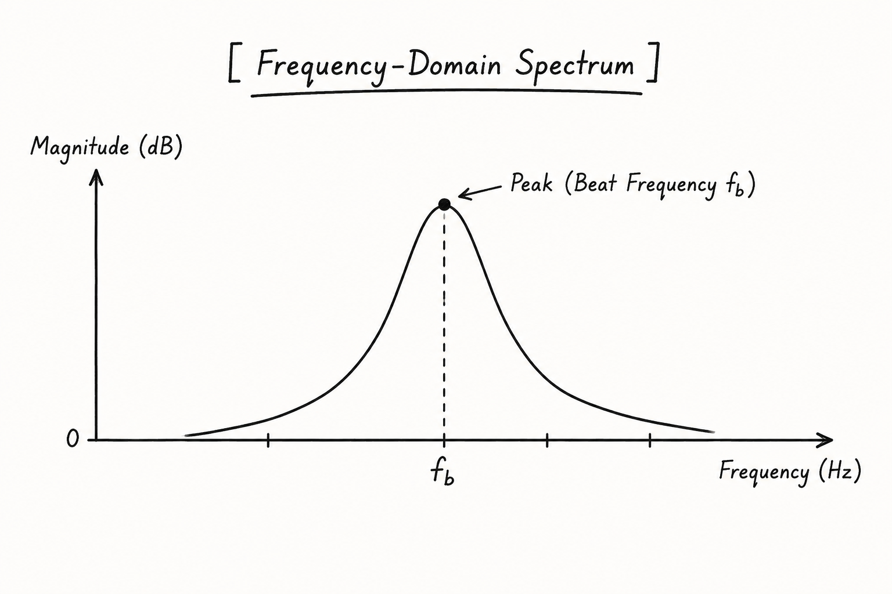

Once the Analog-to-Digital Converter (ADC) finishes digitizing the low-frequency beat signal into digital memory, the raw time-domain voltage values are stored in a 3D NumPy array:

$$\text{Shape: } (K \text{ Antennas}, M \text{ Chirps}, N \text{ Samples})$$

At this point, our matrix holds raw, time-varying voltage fluctuations. To transform these raw numbers into physical spatial coordinates—**Distance ($R$)**, **Radial Velocity ($v$)**, and **Azimuth Angle ($\theta$)**—we must run the data through a continuous signal processing chain.

Before diving into distance calculations, we need to understand the core mathematical engine that powers every stage of this pipeline: the **Fast Fourier Transform (FFT)**.

## 1. What is the Fast Fourier Transform (FFT)?

Signals in the physical world are naturally measured in the **Time Domain**—meaning we record how a physical quantity (like voltage) changes from moment to moment. However, a time-domain wave is often a messy composite of multiple underlying frequencies overlapping simultaneously.

The **Fourier Transform** is a mathematical tool that decomposes a continuous time-domain signal into its individual constituent sine wave frequencies. It shifts our perspective from watching a signal evolve over time to seeing a breakdown of which frequencies are present and how strong they are.

The **Fast Fourier Transform (FFT)** is simply an optimized algorithm (developed by Cooley and Tukey) that computes the Discrete Fourier Transform (DFT) in $O(N \log N)$ operations instead of $O(N^2)$. In radar DSP, the FFT acts as a prism—splitting complex, mixed voltage signals into clean, isolated frequency peaks.

## 2. Bridging Domains: Voltage Time-Domain to Frequency Domain

To understand why we need domain transformation, consider what raw ADC output looks like. If you plot raw ADC voltage samples across a single chirp, you get a continuous sine wave oscillating over time:


While this waveform records the exact voltage at every microsecond, **it does not directly tell us the frequency of oscillation**. Because distance in FMCW radar is directly proportional to beat frequency ($f_b$), looking at raw voltages alone is unhelpful.

When we apply the **FFT**, we mathematically warp our coordinate space from time to frequency:

$$\text{Time Domain: Voltage } V(t) \quad \xrightarrow{\quad \text{FFT} \quad} \quad \text{Frequency Domain: Spectrum } A(f)$$



After domain transformation:

- The **X-axis** shifts from **Time ($t$ in samples)** to **Frequency ($f$ in Hz)**.
    
- The **Y-axis** shifts from **Instantaneous Voltage ($mV$)** to **Signal Magnitude ($dB$)**.
    

Instead of a messy time-domain wave, we get a clean frequency spectrum where target reflections appear as sharp, distinct magnitude peaks.

## 3. Fast-Time Range Processing (Distance Extraction)

Now that we have established how domain transformation extracts frequency from time-domain voltages, we apply this operation to our first spatial dimension: **Distance**.

### The Problem: Boundary Truncation & Spectral Leakage

The ADC captures a finite block of $N$ voltage samples during each chirp duration ($T_c$). Mathematically, the FFT assumes that this finite sample block repeats infinitely into the past and future.

Because a real-world beat signal rarely ends on a complete sine cycle within the sampling window, the abrupt array boundaries create sharp voltage jumps. These artificial jumps act as high-frequency impulse noise. Running an FFT directly on raw samples causes **spectral leakage**—energy from a true target peak "leaks" out into surrounding frequency bins, creating high side lobes that can submerge smaller nearby targets.

### The Solution: Pre-FFT Windowing

To prevent boundary cuts, we multiply the $N$ Fast-Time samples of every chirp by a bell-shaped **window function** (such as a **Hann Window**) before transforming domains:

$$w[n] = 0.5 \left(1 - \cos\left(\frac{2\pi n}{N-1}\right)\right)$$

The window function scales down the voltage amplitudes at the start and end edges of the sample block to zero, smoothing out the boundary jumps while preserving the waveform shape in the center.

### Computing the 1D Range FFT

With boundary leakage suppressed, we execute a **1D Fast Fourier Transform along Axis 2 (Fast-Time Samples)** across all chirps and antenna channels simultaneously:

$$\mathbf{Z}_{\text{Range}} = \text{FFT}_{\text{Fast-Time}}(w \odot \mathbf{X}_{\text{ADC}})$$

- **Domain Shift:** Converts Axis 2 from **Fast-Time Voltage Samples** to **Beat Frequency ($f_b$) Bins**.
    
- **Physical Mapping:** The dominant frequency bin index ($k_r$) converts directly into target distance ($R$) in meters:
    

$$R = \frac{c \cdot k_r \cdot F_s \cdot T_c}{2 \cdot N_{\text{FFT}} \cdot B}$$

## 4. Static Clutter Removal (Zero-Doppler Filtering)

Having converted our raw voltages into a Range Spectrum matrix, we now face another environmental challenge: **background interference**. Before we can process velocity across chirps, we must clean out non-moving reflections.

### The Problem: Stationary Background Interference

In real-world environments, massive stationary reflections—such as asphalt, concrete walls, road signposts, or internal antenna spillover—reflect strong signals back to the radar.

Because these objects do not move relative to the radar, their reflections remain identical across consecutive chirps, generating a large zero-velocity ($0\text{ m/s}$) signal spike that can drown out smaller moving targets (such as pedestrians or bicycles).

### The Solution: Mean Subtraction / High-Pass MTI Filter

Because stationary reflections do not change over time, they manifest as a constant DC offset vector along the **Slow-Time Axis ($M$ chirps)**.

We remove static clutter by calculating the complex mean across the chirp axis for every range bin and subtracting it from the matrix:

$$\mathbf{Z}_{\text{Filtered}}[:, m, :] = \mathbf{Z}_{\text{Range}}[:, m, :] - \frac{1}{M} \sum_{i=0}^{M-1} \mathbf{Z}_{\text{Range}}[:, i, :]$$

Subtracting this baseline average eliminates zero-velocity static reflections while preserving phase variations caused by moving targets.

## 5. Slow-Time Doppler Processing (Velocity Extraction)

With background clutter wiped clean, we can now track how moving targets change from chirp to chirp across time. This allows us to extract our second physical dimension: **Radial Velocity**.

### The Problem: Extracting Sub-Millimeter Motion

When a target moves relative to the radar, its physical distance changes slightly between consecutive chirps. Although this tiny movement ($<\text{1 mm}$) is too small to shift the target to a different range bin, it causes a precise **phase shift ($\Delta \phi$)** in the beat signal from chirp to chirp.

### Computing the 1D Doppler FFT

To measure how fast this phase angle changes across time, we apply a slow-time window function across the $M$ chirps and execute a second **1D Fast Fourier Transform along Axis 1 (Slow-Time Chirps)**:

$$\mathbf{RDM} = \text{FFT}_{\text{Slow-Time}}(w_{\text{doppler}} \odot \mathbf{Z}_{\text{Filtered}})$$

- **Domain Shift:** Converts Axis 1 from **Slow-Time Chirp Indices** to **Doppler Frequency ($f_d$) Bins**.
    
- **Physical Mapping:** The Doppler frequency bin index ($k_d$) converts directly into target radial velocity ($v$) in meters per second:
    

$$v = \frac{\lambda \cdot k_d}{2 \cdot M \cdot T_c}$$

- **Output Tensor:** A 2D **Range-Doppler Map (RDM)** showing target Distance ($R$) on one axis and Speed ($v$) on the other.
    

## 6. Spatial Angle Processing (Direction Extraction)

Now that we have isolated targets by their distance and speed, we need to locate where they sit in 3D space. This brings us to our third physical dimension: **Azimuth Angle**.

### The Problem: Spatial Separation Across Antennas

To calculate target direction, the radar uses multiple receiver antennas ($K$ channels) spaced at a fixed physical distance ($d_{\text{ant}} = \frac{\lambda}{2}$).

When a reflected wave returns at an angle ($\theta$), it travels a slightly different path length to reach each antenna element. This path length difference ($d_{\text{ant}} \sin\theta$) creates a spatial phase shift across **Axis 0 (Rx Channels)**.

### Computing the 1D Spatial Angle FFT

Executing a third **1D Fast Fourier Transform along Axis 0 (Spatial Channels)** transforms antenna channel phase shifts into spatial frequency bins:

$$\mathbf{Cube}_{\text{3D}} = \text{FFT}_{\text{Spatial}}(\mathbf{RDM})$$

- **Domain Shift:** Converts Axis 0 from **Physical Antenna Channels** to **Spatial Frequency Bins**.
    
- **Physical Mapping:** The spatial frequency bin index ($k_a$) converts directly into target azimuth angle ($\theta$) in degrees/radians:
    

$$\theta = \arcsin\left(\frac{\lambda \cdot k_a}{K \cdot d_{\text{ant}}}\right)$$

- **Output Tensor:** A fully populated **3D Range-Doppler-Angle Data Cube** representing physical space: $(R, v, \theta)$.
    

## Complete Pipeline Flow Summary

```
Raw 3D ADC Matrix (K x M x N) [Time Domain Voltages]
        │
        ▼
[Domain Bridge: Time ➔ Frequency] Fast-Time Windowing & 1D Range FFT (Axis 2)
        │
        ▼
Range Spectrum Matrix [Beat Frequency fb = Distance R]
        │
        ▼
Static Clutter Removal ➔ Subtracts slow-time mean to remove 0 m/s stationary objects
        │
        ▼
1D Doppler FFT (Axis 1) ➔ Converts slow-time phase shifts to Radial Velocity (v)
        │
        ▼
1D Spatial FFT (Axis 0) ➔ Converts spatial antenna phase shifts to Azimuth Angle (θ)
```